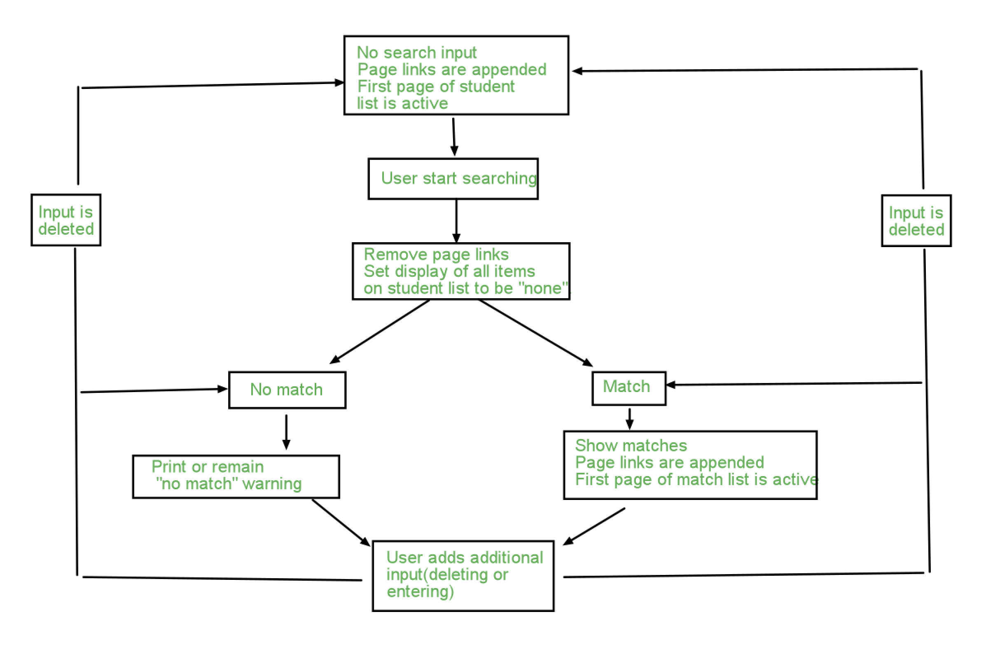

# List_Pagination_and_Filtering

This web page was designed to display a student list. Pagination and a search bar was implemented by manipulating JavaScript  DOM to improve user's experience. One long list will be divided into a series of "pages". Each page shows 10 students' info. When specific page link is selected, the background color of the link will change and shows user that it is currently active. When user are keying in student's name, the matching result will display immediately along with a corresponding pagination appended. When no results returned, "There are no matches" message will be printed to the web page.

Logical process flow diagram:

List of the “Extra Credit” features added for “Exceeds Expectations” grade
1.Add search component
2.Add functionality to the search component
3.Paginate search results
4.Handle no results returned
